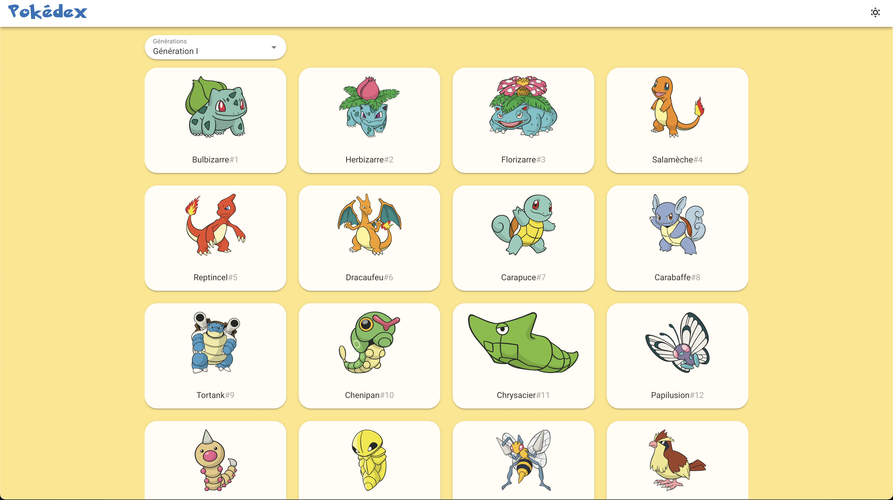

# Yet another Pokédex
##### Academic purpose - a good exercise to learn Vue for students
###### This repo serves as a homework corrected but there are many ways to do it



## Project setup

```
# yarn
yarn

# npm
npm install

# pnpm
pnpm install
```

### Compiles and hot-reloads for development

```
# yarn
yarn dev

# npm
npm run dev

# pnpm
pnpm dev
```

### Compiles and minifies for production

```
# yarn
yarn build

# npm
npm run build

# pnpm
pnpm build
```

### Customize configuration

See [Configuration Reference](https://vitejs.dev/config/).
